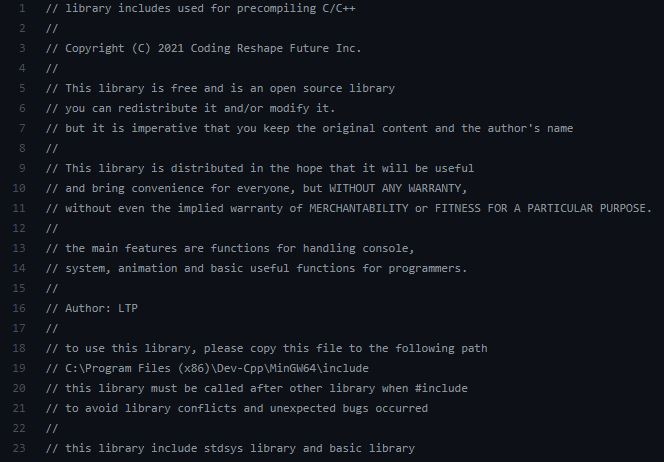
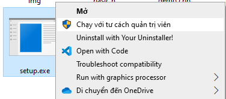
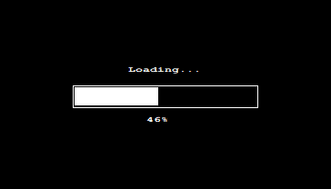

# The library C/C++ about system and handle console
<p align="center">
  <br>
  <a href="#"></a>
  <br>
  <a href="#Download"></a>
  <a href="#" target="_blank"></a>
  <br>
  <a href="#"><strong><i>Copyright (C) 2021 Coding Reshape Future Inc.</i></strong></a>
  <br><br><br>
</p>

---
<a href="https://www.youtube.com/watch?v=RJ-Tw1pEGZw">
  
</a>

This library is free and is an open source library you can redistribute it and/or modify it.
but it is imperative that you keep the original content and the author's name
<br>
This library is distributed in the hope that it will be useful, and bring convenience for everyone, but WITHOUT ANY WARRANTY; without even the implied warranty of MERCHANTABILITY or FITNESS FOR A PARTICULAR PURPOSE.
<br>
The main features are functions for handling console, system, animation and basic useful functions for programmers.

---
## Some functions

Some functions are:
```c++
MaxConsole; // maximize the console
MinConsole; // minimize the console
UTF_8; // enable (UTF-8) mode
fast; // fast Input/Output
clear; // clear the console
pause; // pause the console (press any key to continue . . .)
exit; // exit the program

gotoxy(x, y); // move the cursor to x, y
textcolor(color); // set the text color
bgcolor(text_color, background_color); // set the background color
linecolor(text_color, line_color); // set the line color

whereX(); // get current cursor position in x axis
whereY(); // get current cursor position in y axis
WhereMouseX(); // get current mouse position in x axis
WhereMouseY(); // get current mouse position in y axis

cursor(visible); // set cursor visible or not
Scrollbar(visible); // set scrollbar visible or not
SetConsoleSize(width, height); // set the console size
SetConsoleBufferSize(width, height); // set the console buffer size
SetConsoleTitle(title); // set the console title
DisableResize(); // disable the console resize
DisableMenu(Minimize, Maximize, Close); // disable the console menu (minimize, maximize, close)
DisableSelect(); // disable the console select

print(string, time_total, color); // print string with slow motion and color
flashing(string, time_delay, time_total); // print string with flashing and color
title(string); // set the console title
delay(seconds); // pause for a period of time
SetMousePosition(x, y); // set the mouse position
ShowMousePosition(placeX, placeY); // show the mouse position at placeX, placeY
Menu(&key, title, number_of_choice, choice1, choice2, choice ...) // create a game menu
```
...
and more other

Basic functions are:
```c++
swap(a, b); // swap two elements (int, char, float, double, long long)
random(min, max); // random a number in range [min, max)
fact(n); // factorial of n
gcd(a, b); // greatest common divisor of a and b
lcm(a, b); // least common multiple of a and b
inArr(arr, n); // input Array
outArr(arr, n); // output Array

sort(arr, n, reverse); // merge sort Array
sort(s, reverse); // sort string alphabet
find(arr, n, value, start); // find position of the first index of element in array
find(arr, n, value, start); // find position of the first index of element in string
del(s, index); // delete a character in string
del(arr, index); // delete a element in array
insert(s, index, value); // insert a character in string
insert(arr, n, index, value); // insert an element in array

abs(a); // absolute value of a
max(arr, n); // max of array
max(a, b); // max of a and b
max(a, b, c); // max of a, b and c
min(arr, n); // min of array
min(a, b); // min of a and b
min(a, b, c); // min of a, b and c
sum(arr, n); // sum of array

combination(k, n); // combination k of n elements
permutation(k, n); // permutation k of n elements
wordcount(string); // count the number of words in a sentence
format(string, upper_each_first_letter); // format a string
reverseWord(string); //reverse a words in string
reverse(string); // reverse string
```
...
and more other

---
## Download

You can click <a href="https://github.com/lucthienphong1120/stdsys.h/archive/refs/heads/main.zip">Download the library</a> or using Git
```
git clone https://github.com/lucthienphong1120/stdsys.h.git
```
---
### Set up

To use this library, you must right click and run the setup.exe with administrator to automatic setup
<p align="center"></p>
<p align="center"></p>

Or you can manually copy 2 files stdsys.h and basic.h to the following path
```
C:\Program Files (x86)\Dev-Cpp\MinGW64\include
```

<a href="https://www.youtube.com/watch?v=RJ-Tw1pEGZw">See this video</a>

---
## Usage

This library must be called after other library when include to avoid library conflicts and unexpected bugs occurred.
```c++
#include <stdsys.h>
// or
#include <basic.h>
```
The <stdsys.h> library already includes the <basic.h> library

---
## Example

```
g++ demo.cpp -o demo.exe
.\demo.exe
```

---
## Note

Because the library is under development, it is possible that some old compilers can cause errors, please use C++11 version or higher to avoid unexpected errors.
