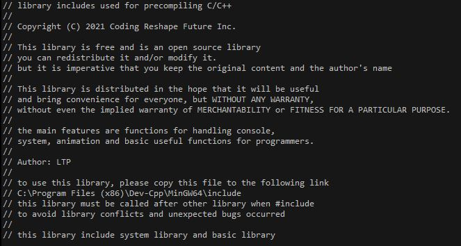

# The library C/C++ about system and handle console
<p align="center">
  <br>
  <a href="#"></a>
  <br>
  <a href="#Download"></a>
  <a href="#" target="_blank"></a>
  <br>
  <a href="#"><strong><i>Copyright (C) 2021 Coding Reshape Future Inc.</i></strong></a>
  <br><br><br>
</p>

---

<a href="https://www.youtube.com/watch?v=5pH4j6daJN8">
  
</a>

This library is free and is an open source library you can redistribute it and/or modify it.
but it is imperative that you keep the original content and the author's name
<br>
This library is distributed in the hope that it will be useful, and bring convenience for everyone, but WITHOUT ANY WARRANTY; without even the implied warranty of MERCHANTABILITY or FITNESS FOR A PARTICULAR PURPOSE.
<br>
The main features are functions for handling console, system, animation and basic useful functions for programmers.

---

## Some functions

Some functions are:
```c++
MaxConsole; // maximize the console
MinConsole; // minimize the console
UTF_8; // enable (UTF-8) mode
fast; // fast Input/Output
clear; // clear the console
pause; // pause the console (press any key to continue . . .)
exit; // exit the program
gotoxy(x, y); // move the cursor to x, y
textcolor(color); // set the text color
bgcolor(text_color, background_color); // set the background color
linecolor(text_color, line_color); // set the line color
whereX(); // get current cursor position in x axis
whereY(); // get current cursor position in y axis
cursor(visible); // set cursor visible or not
Scrollbar(visible); // set scrollbar visible or not
SetConsoleSize(width, height); // set the console size
SetConsoleBufferSize(width, height); // set the console buffer size
SetConsoleTitle(title); // set the console title
DisableResize(); // disable the console resize
DisableMenu(); // disable the console menu (minimize, maximize, close)
DisableSelect(Minimize, Maximize, Close); // disable the console select
print(string, time_total, color); // print string with slow motion and color
flashing(string, time_total, color); // print string with flashing and color
title(string); // set the console title
ShowMousePosition(placeX, placeY); // show the mouse position at placeX, placeY
```
...
Basic functions are:
```c++
swap(a, b); // swap two elements
random(min, max); // random a number in range [min, max)
fact(n); // factorial of n
gcd(a, b); // greatest common divisor of a and b
lcm(a, b); // least common multiple of a and b
inArr(arr, n); // input Array
outArr(arr, n); // output Array
sort(arr, n); // merge sort Array
afind(arr, n, value, start); // find position of the first index of element in array
sfind(arr, n, value, start); // find position of the first index of element in string
sdel(s, index); // delete a character in string
adel(arr, index); // delete a element in array
sinsert(s, index, value); // insert a character in string
ainsert(arr, index, value); // insert an element in array
max(a, b); // max of a and b
max(a, b, c); // max of a, b and c
min(a, b); // min of a and b
min(a, b, c); // min of a, b and c
abs(a); // absolute value of a
max(arr, n); // max of array
min(arr, n); // min of array
sum(arr, n); // sum of array
combination(k, n); // combination k of n elements
permutation(k, n); // permutation k of n elements
wc(string); // count the number of words in a sentence
format(string, upper_each_first_letter); // format a string
```
...

## Download

<a href="https://github.com/lucthienphong1120/systemh-lib/archive/refs/heads/main.zip">Download the library</a>

To use this library, please copy this file to the following link
```
C:\Program Files (x86)\Dev-Cpp\MinGW64\include
```

## Usage

This library must be called after other library when include to avoid library conflicts and unexpected bugs occurred.
```c
#include <system.h>
or
#include <basic.h>
```
The <system.h> library already includes the <basic.h> library

## License

Licensed under the [GPLv3.0]
